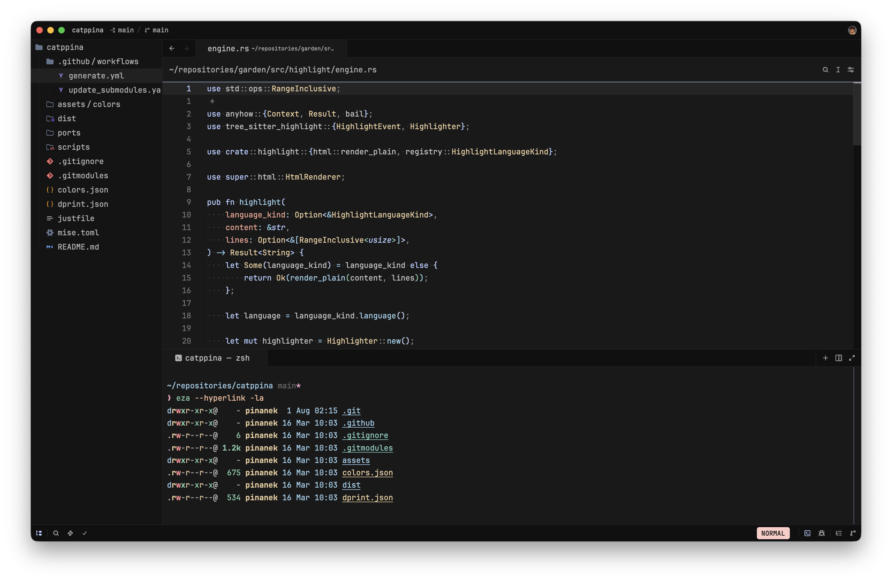
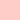
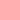
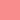
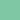

# 😻 Catppina

<p align="center">
  <strong>A custom Catppuccin-inspired color palette for my favorite applications.</strong>
</p>

<p align="center">
  
</p>

## ✨ About

**Catppina** is a collection of themes based on the
[Catppuccin](https://catppuccin.com) ecosystem, rebuilt using my custom dark
color palette.

Generated themes are available in the [`dist`](dist/) directory.

## 🌈 Color palette

<table>
<thead>
<tr>
<th width="150px" align="left">Color</th>
<th width="100px" align="center">HEX</th>
<th width="230px" align="center">RGB</th>
<th width="230px" align="center">HSL</th>
<th width="290px" align="center">OKLCH</th>
</tr>
</thead>
<tbody>
<tr>
<td> <strong>Rosewater</strong></td>
<td align="center"><code>#ffcdc7</code></td>
<td align="center"><code>rgb(255, 205, 199)</code></td>
<td align="center"><code>hsl(6 100% 89%)</code></td>
<td align="center"><code>oklch(89.0% 0.058 26.2)</code></td>
</tr>
<tr>
<td> <strong>Flamingo</strong></td>
<td align="center"><code>#ffafaf</code></td>
<td align="center"><code>rgb(255, 175, 175)</code></td>
<td align="center"><code>hsl(0 100% 84%)</code></td>
<td align="center"><code>oklch(83.1% 0.094 19.3)</code></td>
</tr>
<tr>
<td> <strong>Pink</strong></td>
<td align="center"><code>#e99cba</code></td>
<td align="center"><code>rgb(233, 156, 186)</code></td>
<td align="center"><code>hsl(337 64% 76%)</code></td>
<td align="center"><code>oklch(77.7% 0.099 354.6)</code></td>
</tr>
<tr>
<td> <strong>Mauve</strong></td>
<td align="center"><code>#b5ccff</code></td>
<td align="center"><code>rgb(181, 204, 255)</code></td>
<td align="center"><code>hsl(221 100% 85%)</code></td>
<td align="center"><code>oklch(84.6% 0.076 265.8)</code></td>
</tr>
<tr>
<td> <strong>Red</strong></td>
<td align="center"><code>#f88d8e</code></td>
<td align="center"><code>rgb(248, 141, 142)</code></td>
<td align="center"><code>hsl(359 88% 76%)</code></td>
<td align="center"><code>oklch(75.8% 0.130 20.0)</code></td>
</tr>
<tr>
<td> <strong>Maroon</strong></td>
<td align="center"><code>#f1a290</code></td>
<td align="center"><code>rgb(241, 162, 144)</code></td>
<td align="center"><code>hsl(11 78% 75%)</code></td>
<td align="center"><code>oklch(78.5% 0.098 33.4)</code></td>
</tr>
<tr>
<td> <strong>Peach</strong></td>
<td align="center"><code>#fbc19d</code></td>
<td align="center"><code>rgb(251, 193, 157)</code></td>
<td align="center"><code>hsl(23 92% 80%)</code></td>
<td align="center"><code>oklch(85.5% 0.082 53.1)</code></td>
</tr>
<tr>
<td> <strong>Yellow</strong></td>
<td align="center"><code>#e9cc9c</code></td>
<td align="center"><code>rgb(233, 204, 156)</code></td>
<td align="center"><code>hsl(37 64% 76%)</code></td>
<td align="center"><code>oklch(85.8% 0.071 80.1)</code></td>
</tr>
<tr>
<td> <strong>Green</strong></td>
<td align="center"><code>#7fc7a4</code></td>
<td align="center"><code>rgb(127, 199, 164)</code></td>
<td align="center"><code>hsl(151 39% 64%)</code></td>
<td align="center"><code>oklch(77.2% 0.089 162.3)</code></td>
</tr>
<tr>
<td> <strong>Teal</strong></td>
<td align="center"><code>#7ecebe</code></td>
<td align="center"><code>rgb(126, 206, 190)</code></td>
<td align="center"><code>hsl(168 45% 65%)</code></td>
<td align="center"><code>oklch(79.5% 0.082 179.9)</code></td>
</tr>
<tr>
<td> <strong>Sky</strong></td>
<td align="center"><code>#8fc9e6</code></td>
<td align="center"><code>rgb(143, 201, 230)</code></td>
<td align="center"><code>hsl(200 64% 73%)</code></td>
<td align="center"><code>oklch(80.6% 0.072 230.4)</code></td>
</tr>
<tr>
<td> <strong>Sapphire</strong></td>
<td align="center"><code>#94d1e5</code></td>
<td align="center"><code>rgb(148, 209, 229)</code></td>
<td align="center"><code>hsl(195 61% 74%)</code></td>
<td align="center"><code>oklch(82.6% 0.068 220.3)</code></td>
</tr>
<tr>
<td> <strong>Blue</strong></td>
<td align="center"><code>#9ccfe9</code></td>
<td align="center"><code>rgb(156, 207, 233)</code></td>
<td align="center"><code>hsl(200 64% 76%)</code></td>
<td align="center"><code>oklch(82.8% 0.064 230.6)</code></td>
</tr>
<tr>
<td> <strong>Lavender</strong></td>
<td align="center"><code>#c1d0f2</code></td>
<td align="center"><code>rgb(193, 208, 242)</code></td>
<td align="center"><code>hsl(222 65% 85%)</code></td>
<td align="center"><code>oklch(85.7% 0.050 266.5)</code></td>
</tr>
<tr>
<td> <strong>Text</strong></td>
<td align="center"><code>#c3c3c4</code></td>
<td align="center"><code>rgb(195, 195, 196)</code></td>
<td align="center"><code>hsl(240 1% 77%)</code></td>
<td align="center"><code>oklch(81.7% 0.001 286.4)</code></td>
</tr>
<tr>
<td> <strong>Subtext 1</strong></td>
<td align="center"><code>#b2b2b3</code></td>
<td align="center"><code>rgb(178, 178, 179)</code></td>
<td align="center"><code>hsl(240 1% 70%)</code></td>
<td align="center"><code>oklch(76.4% 0.001 286.4)</code></td>
</tr>
<tr>
<td> <strong>Subtext 0</strong></td>
<td align="center"><code>#a0a0a1</code></td>
<td align="center"><code>rgb(160, 160, 161)</code></td>
<td align="center"><code>hsl(240 1% 63%)</code></td>
<td align="center"><code>oklch(70.6% 0.001 286.4)</code></td>
</tr>
<tr>
<td> <strong>Overlay 2</strong></td>
<td align="center"><code>#939394</code></td>
<td align="center"><code>rgb(147, 147, 148)</code></td>
<td align="center"><code>hsl(240 0% 58%)</code></td>
<td align="center"><code>oklch(66.4% 0.001 286.4)</code></td>
</tr>
<tr>
<td> <strong>Overlay 1</strong></td>
<td align="center"><code>#757576</code></td>
<td align="center"><code>rgb(117, 117, 118)</code></td>
<td align="center"><code>hsl(240 0% 46%)</code></td>
<td align="center"><code>oklch(56.3% 0.002 286.4)</code></td>
</tr>
<tr>
<td> <strong>Overlay 0</strong></td>
<td align="center"><code>#636364</code></td>
<td align="center"><code>rgb(99, 99, 100)</code></td>
<td align="center"><code>hsl(240 1% 39%)</code></td>
<td align="center"><code>oklch(50.0% 0.002 286.3)</code></td>
</tr>
<tr>
<td> <strong>Surface 2</strong></td>
<td align="center"><code>#434344</code></td>
<td align="center"><code>rgb(67, 67, 68)</code></td>
<td align="center"><code>hsl(240 1% 26%)</code></td>
<td align="center"><code>oklch(38.3% 0.002 286.3)</code></td>
</tr>
<tr>
<td> <strong>Surface 1</strong></td>
<td align="center"><code>#323233</code></td>
<td align="center"><code>rgb(50, 50, 51)</code></td>
<td align="center"><code>hsl(240 1% 20%)</code></td>
<td align="center"><code>oklch(31.8% 0.002 286.3)</code></td>
</tr>
<tr>
<td> <strong>Surface 0</strong></td>
<td align="center"><code>#212122</code></td>
<td align="center"><code>rgb(33, 33, 34)</code></td>
<td align="center"><code>hsl(240 1% 13%)</code></td>
<td align="center"><code>oklch(24.8% 0.002 286.3)</code></td>
</tr>
<tr>
<td> <strong>Base</strong></td>
<td align="center"><code>#19191a</code></td>
<td align="center"><code>rgb(25, 25, 26)</code></td>
<td align="center"><code>hsl(240 2% 10%)</code></td>
<td align="center"><code>oklch(21.4% 0.002 286.2)</code></td>
</tr>
<tr>
<td> <strong>Mantle</strong></td>
<td align="center"><code>#141415</code></td>
<td align="center"><code>rgb(20, 20, 21)</code></td>
<td align="center"><code>hsl(240 2% 8%)</code></td>
<td align="center"><code>oklch(19.2% 0.002 286.2)</code></td>
</tr>
<tr>
<td> <strong>Crust</strong></td>
<td align="center"><code>#101011</code></td>
<td align="center"><code>rgb(16, 16, 17)</code></td>
<td align="center"><code>hsl(240 3% 6%)</code></td>
<td align="center"><code>oklch(17.3% 0.002 286.2)</code></td>
</tr>
</tbody>
</table>

## 📦 Ports

| Application                                                                        | Theme files                                                     |
| ---------------------------------------------------------------------------------- | --------------------------------------------------------------- |
| 🦇 [bat](https://github.com/sharkdp/bat)                                           | [`dist/bat`](dist/bat/)                                         |
| 🧙 [btop](https://github.com/aristocratos/btop)                                    | [`dist/btop`](dist/btop/)                                       |
| ➕ [delta](https://github.com/dandavison/delta)                                     | [`dist/delta`](dist/delta/)                                    |
| 🐟 [fish](https://fishshell.com)                                                   | [`dist/fish`](dist/fish/)                                       |
| 🌸 [fzf](https://github.com/junegunn/fzf)                                          | [`dist/fzf`](dist/fzf/)                                         |
| 👻 [Ghostty](https://ghostty.org)                                                  | [`dist/ghostty`](dist/ghostty/)                                 |
| ➿ [Helix](https://helix-editor.com)                                                | [`dist/helix`](dist/helix/)                                    |
| 🍴 [lazygit](https://github.com/jesseduffield/lazygit)                             | [`dist/lazygit`](dist/lazygit/)                                 |
| 💥 [Yazi](https://yazi-rs.github.io)                                               | [`dist/yazi`](dist/yazi/)                                       |
| 🦀 [Zed](https://zed.dev)                                                          | [`dist/zed`](dist/zed/)                                         |
| 🪗 [zsh-syntax-highlighting](https://github.com/zsh-users/zsh-syntax-highlighting) | [`dist/zsh-syntax-highlighting`](dist/zsh-syntax-highlighting/) |

## 🛠️ Building

### Requirements

- [just](https://github.com/casey/just)
- [Deno](https://deno.com)
- [Whiskers](https://github.com/catppuccin/whiskers)
- Python 3

### Build all ports

```sh
just build
````

### Build a specific port

```sh
just build_helix
```

### List available recipes

```sh
just
```

## 📁 Repository structure

```text
.
├── assets/
├── dist/
├── ports/
├── scripts/
├── colors.json
└── justfile
```

* `assets`: README images and color previews.
* `dist`: generated theme files.
* `ports`: upstream Catppuccin port templates.
* `scripts`: additional theme conversion scripts.
* `colors.json`: Catppina color palette.
* `justfile`: build recipes.

## ❤️ Credits

* [Catppuccin](https://catppuccin.com) for the original color palette,
  templates, ports, and ecosystem.
* The maintainers of every supported application and Catppuccin port.
